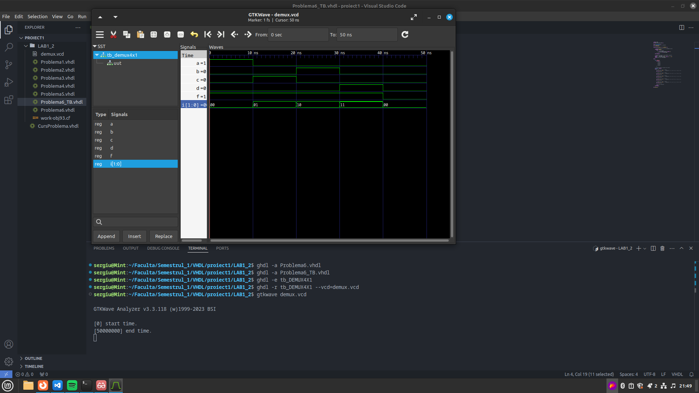

1. Instalati  GHDL si gtkwave gasiti pe youtube cum sa faceti sau cu chatgpt
2. instalati extensie in VScode sau puteti folosi notepad++(suporta vhdl)

pentru mai multe informati despre vhdl si cum functioneaza si ce face fiecare 
chestie va puteti uita la cursul 2 (videoclip) de pe campus sau va uitati in laboratorul 1_2 de pe campus

cum rulam codul:

deschidem un terminal in vscode care se afla in folderul cu proiecte sau deschizi un terminal in windows/linux si intri in folderul respectiv

rulezi urmatoarele comenzi
ghdl -a (numele fiserului).vhdl

ghdl -a (numele fisierului test bench).vhdl

ghdl -e (nuemle entitatii declarata in fisierul test bench)

ghdl -r (nuemle entitatii declarata in fisierul test bench) --vcd=demux.vcd

ar trebuii sa se creeze 2 fisiere noi 
unu in care se salveaza configurarea pe care ghdl o creaza 
si unu pentru a rula coudul in gtkwave

EXEMPLU FACUT CU PROBLEMA 6 

sau daca nu aveti chef de asa ceva ii dati codul la chatgpt si va spune deca este bun sau nu :) 
sau va uitati peste https://youtu.be/H2GyAIYwZbw?si=PCQ1pZmOvqhQdbjN ca explica bine si aplicati pe codul vostru 
